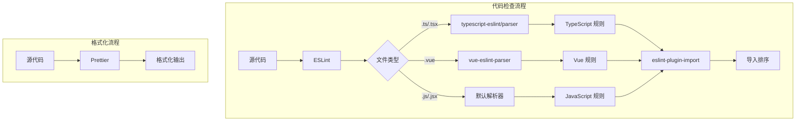

# 设计文档

## 概述

本设计文档描述如何增强 Vue/TypeScript 项目的代码整理功能。主要包括：
1. 添加 TypeScript ESLint 支持
2. 优化导入语句排序配置
3. 配置便捷的 npm 脚本
4. 更新忽略文件以支持 TypeScript

## 架构

### 工具链架构



### 配置文件关系

```mermaid
graph LR
    A[.eslintrc.cjs] --> B[ESLint 核心]
    C[tsconfig.json] --> D[@typescript-eslint/parser]
    D --> B
    E[.prettierrc] --> F[Prettier]
    B --> G[代码检查]
    F --> H[代码格式化]
```

## 组件和接口

### 1. ESLint 配置组件

**文件**: `.eslintrc.cjs`

**职责**:
- 配置 TypeScript 解析器
- 定义代码规则
- 配置导入排序规则

**关键配置**:

```javascript
// TypeScript 解析器配置
parserOptions: {
  parser: "@typescript-eslint/parser",
  project: "./tsconfig.json",
  extraFileExtensions: [".vue"]
}

// 扩展配置
extends: [
  "eslint:recommended",
  "plugin:@typescript-eslint/recommended",
  "plugin:import/recommended",
  "plugin:import/typescript",
  "plugin:vue/vue3-recommended",
  "prettier"
]
```

### 2. 导入排序配置

**规则**: `import/order`

**排序顺序**:
1. `builtin` - Node.js 内置模块
2. `external` - 外部依赖（vue、vant 优先）
3. `internal` - 内部模块（@/ 别名）
4. `parent` - 父级目录导入
5. `sibling` - 同级目录导入
6. `index` - 索引文件
7. `object` - 对象导入
8. `type` - 类型导入

**配置示例**:

```javascript
"import/order": [
  "error",
  {
    groups: [
      "builtin",
      "external",
      "internal",
      "parent",
      "sibling",
      "index",
      "object",
      "type"
    ],
    pathGroups: [
      { pattern: "vue", group: "external", position: "before" },
      { pattern: "vant", group: "external", position: "before" },
      { pattern: "@/**", group: "internal", position: "after" }
    ],
    "newlines-between": "always",
    alphabetize: { order: "asc", caseInsensitive: true }
  }
]
```

### 3. NPM 脚本接口

**脚本定义**:

| 脚本名 | 命令 | 用途 |
|--------|------|------|
| `lint` | `eslint src --ext .vue,.ts,.tsx,.js,.jsx` | 检查代码问题 |
| `lint:fix` | `eslint src --ext .vue,.ts,.tsx,.js,.jsx --fix` | 自动修复问题 |
| `format` | `prettier --write "src/**/*.{vue,ts,tsx,js,jsx,json,css,scss}"` | 格式化代码 |

### 4. 导入解析器配置

**文件**: `.eslintrc.cjs` 的 `settings` 部分

**配置**:

```javascript
settings: {
  "import/resolver": {
    typescript: {
      alwaysTryTypes: true,
      project: "./tsconfig.json"
    },
    alias: {
      map: [["@", "./src"]],
      extensions: [".js", ".jsx", ".ts", ".tsx", ".vue"]
    }
  },
  "import/parsers": {
    "@typescript-eslint/parser": [".ts", ".tsx"],
    "vue-eslint-parser": [".vue"]
  }
}
```

## 数据模型

### 依赖包清单

**需要安装的开发依赖**:

```json
{
  "devDependencies": {
    "@typescript-eslint/eslint-plugin": "^7.0.0",
    "@typescript-eslint/parser": "^7.0.0",
    "eslint-import-resolver-typescript": "^3.6.0"
  }
}
```

**已有依赖（无需安装）**:
- `eslint-plugin-import` - 已配置
- `eslint-plugin-unused-imports` - 已配置
- `eslint-config-prettier` - 已配置（通过 extends: ["prettier"]）

### 配置文件变更清单

| 文件 | 变更类型 | 说明 |
|------|----------|------|
| `.eslintrc.cjs` | 修改 | 添加 TypeScript 支持 |
| `.eslintignore` | 修改 | 移除 TS 文件忽略 |
| `package.json` | 修改 | 添加 lint 脚本 |

## 正确性属性

*正确性属性是一种特征或行为，应该在系统的所有有效执行中保持为真——本质上是关于系统应该做什么的形式化陈述。属性作为人类可读规范和机器可验证正确性保证之间的桥梁。*

基于需求分析，本功能主要涉及配置文件的修改，大部分验收标准属于配置正确性验证，而非可通过属性测试验证的运行时行为。

**Property 1: 导入排序一致性**

*对于任意* 包含多个导入语句的源文件，运行 lint:fix 两次应该产生相同的结果（幂等性）。

**验证: 需求 2.1, 2.4, 2.5, 2.6**

**Property 2: 导入分组正确性**

*对于任意* 导入语句，其分组归类应该符合预定义规则：vue/vant 在 external 最前，@/ 别名归类为 internal。

**验证: 需求 2.2, 2.3**

## 错误处理

### ESLint 解析错误

| 错误场景 | 处理方式 |
|----------|----------|
| TypeScript 语法错误 | ESLint 报告解析错误，指出具体位置 |
| 找不到 tsconfig.json | 回退到默认 TypeScript 配置 |
| 导入路径无法解析 | 报告 import/no-unresolved 错误 |

### 配置错误

| 错误场景 | 处理方式 |
|----------|----------|
| 缺少依赖包 | npm install 时报错，提示安装 |
| 规则配置冲突 | ESLint 启动时报告配置错误 |

## 测试策略

### 单元测试

由于本功能主要是配置变更，测试策略侧重于验证配置正确性：

1. **配置验证测试**
   - 验证 ESLint 配置文件语法正确
   - 验证所有必需的插件已安装
   - 验证规则配置无冲突

2. **功能验证测试**
   - 创建测试文件验证 lint 命令正常工作
   - 验证 TypeScript 文件能被正确检查
   - 验证导入排序规则生效

### 属性测试

**Property 1: 导入排序幂等性测试**
- 对任意包含乱序导入的文件，运行 `eslint --fix` 两次
- 验证第二次运行不产生任何变更
- 最少运行 100 次迭代

**Property 2: 导入分组测试**
- 生成包含各类导入的测试文件
- 运行 lint:fix 后验证分组顺序正确
- 验证 vue/vant 在 external 组最前
- 验证 @/ 别名在 internal 组

### 手动验证清单

- [ ] 运行 `npm run lint` 无配置错误
- [ ] 运行 `npm run lint:fix` 能自动修复问题
- [ ] TypeScript 文件被正确检查
- [ ] Vue 文件中的 TypeScript 被正确检查
- [ ] 导入语句按预期顺序排列
