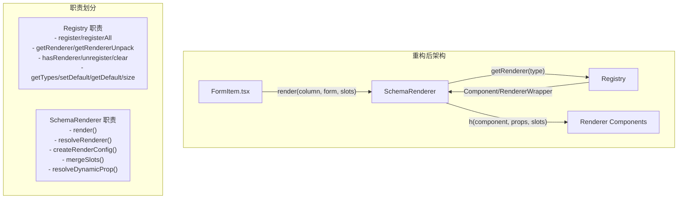

# Design Document: Renderer Refactor

## Overview

本设计文档描述了渲染器模块的重构方案，将 `createRegistry.ts` 和 `createRenderWrapper.ts` 的职责拆分清晰。重构后：

- **Registry（注册中心）**：纯粹的渲染器注册、获取、管理功能
- **SchemaRenderer（渲染器）**：承担所有渲染相关逻辑，包括属性转换、状态合并、插槽处理、动态属性解析

这种分离遵循单一职责原则，使代码更易于测试和维护。

## Architecture



## Components and Interfaces

### 1. Registry Interface (ISchemaRegistry)

Registry 保持纯粹的注册中心职责，移除 `render` 方法：

```typescript
/**
 * 渲染器注册中心接口（重构后）
 */
export interface ISchemaRegistry {
  // 注册方法
  register(type: string, renderer: Component, options?: RegistryOptions): void
  registerAll(renderers: RendererMap): void

  // 获取方法
  getRenderer(type: string): Component | RendererWrapper | undefined
  getRendererUnpack(type: string): Component | undefined

  // 管理方法
  hasRenderer(type: string): boolean
  unregister(type: string): boolean
  clear(): void

  // 元信息方法
  getTypes(): string[]
  setDefault(type: string): void
  getDefault(): string
  size(): number
}
```

### 2. SchemaRenderer Interface (ISchemaRenderer)

新增 SchemaRenderer 接口，承担所有渲染职责：

```typescript
/**
 * 渲染器接口
 */
export interface ISchemaRenderer {
  /** 渲染字段 */
  render(column: ColumnConfig, form: SchemaFormInstance, slots: Slots): VNode | null

  /** 获取关联的 Registry */
  getRegistry(): ISchemaRegistry
}
```

### 3. SchemaRenderer Class

```typescript
/**
 * 渲染器实现
 */
export class SchemaRenderer implements ISchemaRenderer {
  private registry: ISchemaRegistry

  constructor(registry: ISchemaRegistry) {
    this.registry = registry
  }

  getRegistry(): ISchemaRegistry {
    return this.registry
  }

  render(column: ColumnConfig, form: SchemaFormInstance, slots: Slots): VNode | null {
    // 1. 确定组件类型
    // 2. 获取渲染器
    // 3. 解析渲染器和属性转换
    // 4. 创建渲染配置
    // 5. 合并插槽
    // 6. 返回 VNode
  }

  // 私有方法
  private resolveRenderer(...)
  private createRenderConfig(...)
  private mergeSlots(...)
}
```

### 4. Factory Functions

```typescript
// createRegistry - 保持不变
export function createRegistry(defaultType?: string): Registry

// createRenderWrapper - 保持不变，用于创建 RendererWrapper
export function createRenderWrapper(options: CreateRendererOptions): RendererWrapper

// createSchemaRenderer - 新增，用于创建 SchemaRenderer 实例
export function createSchemaRenderer(registry: ISchemaRegistry): SchemaRenderer
```

### 5. useRenderer Hook

通过 provide/inject 管理 Registry 的生命周期和依赖注入：

```typescript
// src/hooks/useRenderer.ts

const RENDERER_KEY = Symbol("SchemaRenderer")

export interface UseRendererOptions {
  /** 跳过默认渲染器注册 */
  skipDefaults?: boolean
  /** 自定义注册回调 */
  setup?: (registry: ISchemaRegistry) => void
}

/**
 * 创建并提供渲染器注册中心
 * 在 SchemaForm 的 setup 中调用
 */
export function useRenderer(options?: UseRendererOptions): ISchemaRegistry

/**
 * 在子组件中获取渲染器注册中心
 */
export function useRendererContext(): ISchemaRegistry
```

## Data Models

### RegistryOptions

```typescript
export interface RegistryOptions {
  /** 属性转换函数 */
  transformProps?: (column: ColumnConfig) => ColumnConfig
  /** 是否覆盖已存在的渲染器 */
  override?: boolean
}
```

### RendererWrapper

```typescript
export interface RendererWrapper {
  /** 渲染器组件 */
  renderer: Component
  /** 属性转换函数 */
  transformProps?: (column: ColumnConfig) => ColumnConfig
}
```

### RenderConfig

```typescript
interface RenderConfig {
  // 解析后的 componentProps
  [key: string]: unknown
  // 表单实例
  formInstance: SchemaFormInstance
  // 表单项属性（column 除 componentProps 外的属性）
  formItemProps: Omit<ColumnConfig, "componentProps">
}
```

### 类型定义位置

| 类型                  | 位置                   | 说明           |
| --------------------- | ---------------------- | -------------- |
| ISchemaRegistry       | createRegistry.ts      | Registry 接口  |
| ISchemaRenderer       | createRenderWrapper.ts | Renderer 接口  |
| RendererWrapper       | types/index.ts         | 渲染器包装类型 |
| RendererMap           | types/index.ts         | 渲染器映射类型 |
| CreateRendererOptions | types/index.ts         | 工厂函数选项   |
| RegistryOptions       | createRegistry.ts      | 注册选项       |

## Correctness Properties

_A property is a characteristic or behavior that should hold true across all valid executions of a system—essentially, a formal statement about what the system should do. Properties serve as the bridge between human-readable specifications and machine-verifiable correctness guarantees._

Based on the prework analysis, the following properties have been identified:

### Property 1: Registry register/get round-trip

_For any_ type string and renderer component, if we register the renderer with that type, then calling `getRenderer` with the same type should return the registered renderer (or RendererWrapper).

**Validates: Requirements 1.1, 1.2, 1.3, 1.8**

### Property 2: Registry unregister removes renderer

_For any_ registered renderer type, after calling `unregister` with that type, `hasRenderer` should return false and `getRenderer` should return undefined.

**Validates: Requirements 1.5, 1.6**

### Property 3: Registry clear resets state

_For any_ Registry with registered renderers, after calling `clear`, `size` should return 0 and `getTypes` should return an empty array.

**Validates: Requirements 1.7, 1.10**

### Property 4: Registry default type round-trip

_For any_ registered renderer type, after calling `setDefault` with that type, `getDefault` should return the same type.

**Validates: Requirements 1.9**

### Property 5: Renderer resolves correct renderer with fallback

_For any_ ColumnConfig with a componentType, if the type is registered, the Renderer should use that renderer; if not registered, it should fall back to the default renderer type.

**Validates: Requirements 2.3, 2.4**

### Property 6: Renderer applies transformProps correctly

_For any_ RendererWrapper with a transformProps function, when rendering, the Renderer should apply transformProps to the ColumnConfig before passing to the component. For plain Components without transformProps, the ColumnConfig should be passed unchanged.

**Validates: Requirements 3.1, 3.2**

### Property 7: Renderer merges state with OR logic

_For any_ combination of readonly/disabled values from props, formItemProps, and form context, the merged state should be true if any of the sources is true (OR logic).

**Validates: Requirements 4.1, 4.2**

### Property 8: Renderer resolves dynamic props

_For any_ componentProps that is a function, the Renderer should call it with current form values. For static objects, they should be used directly. For null/undefined, an empty object should be used.

**Validates: Requirements 5.1, 5.2, 5.3**

### Property 9: Renderer merges slots with correct priority

_For any_ field with both template slots (fieldName:slotName format) and config slots (componentProps.slots), the Renderer should merge them with config slots taking priority over template slots.

**Validates: Requirements 6.1, 6.2, 6.3**

## Error Handling

### Registry Errors

| 场景                               | 处理方式                 |
| ---------------------------------- | ------------------------ |
| 注册已存在的类型（override=false） | 输出警告，跳过注册       |
| 设置不存在的默认类型               | 输出警告，不修改默认类型 |
| 获取不存在的渲染器                 | 返回 undefined           |

### Renderer Errors

| 场景                        | 处理方式                           |
| --------------------------- | ---------------------------------- |
| componentType 未注册        | 使用默认类型，输出警告             |
| 默认类型也未注册            | 返回 null，输出警告                |
| 渲染 DependencyColumnConfig | 返回 null，输出警告                |
| 动态属性函数抛出异常        | 捕获异常，输出错误日志，返回默认值 |
| 渲染器执行异常              | 捕获异常，输出错误日志，返回 null  |

## Testing Strategy

### Unit Tests

单元测试用于验证具体示例和边界情况：

1. **Registry 单元测试**
   - 注册单个渲染器
   - 批量注册渲染器
   - 注册带 transformProps 的渲染器
   - 覆盖已存在的渲染器
   - 禁止覆盖时的行为
   - 移除渲染器
   - 清空所有渲染器

2. **Renderer 单元测试**
   - 渲染基础字段
   - 渲染带 transformProps 的字段
   - 处理未注册的 componentType
   - 处理 DependencyColumnConfig
   - 动态属性解析
   - 插槽合并

### Property-Based Tests

属性测试用于验证通用属性，使用 `fast-check` 库：

- 每个属性测试运行至少 100 次迭代
- 测试标签格式：**Feature: renderer-refactor, Property {number}: {property_text}**

1. **Property 1**: Registry register/get round-trip
2. **Property 2**: Registry unregister removes renderer
3. **Property 3**: Registry clear resets state
4. **Property 4**: Registry default type round-trip
5. **Property 5**: Renderer resolves correct renderer with fallback
6. **Property 6**: Renderer applies transformProps correctly
7. **Property 7**: Renderer merges state with OR logic
8. **Property 8**: Renderer resolves dynamic props
9. **Property 9**: Renderer merges slots with correct priority

### Test File Structure

```
src/renderer/
├── __tests__/
│   ├── createRegistry.test.ts      # Registry 单元测试
│   ├── createRegistry.prop.test.ts # Registry 属性测试
│   ├── SchemaRenderer.test.ts      # Renderer 单元测试
│   └── SchemaRenderer.prop.test.ts # Renderer 属性测试
```
