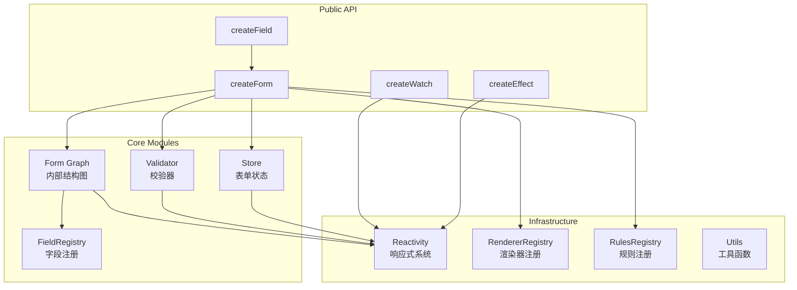
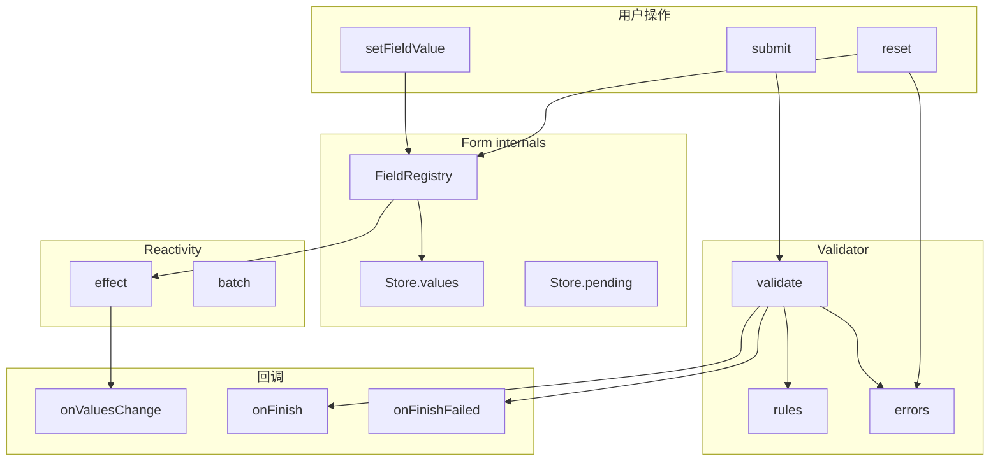
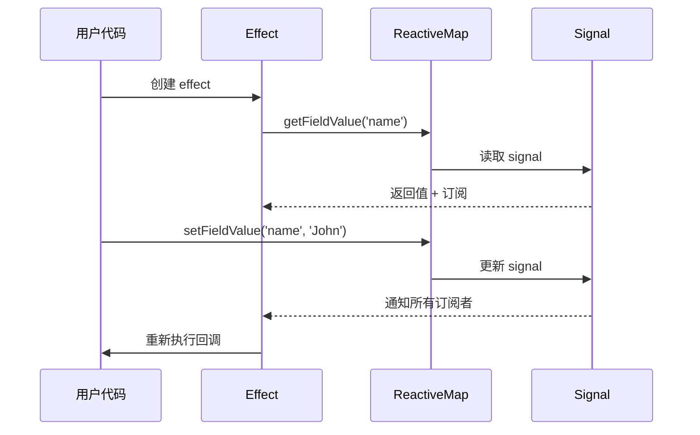
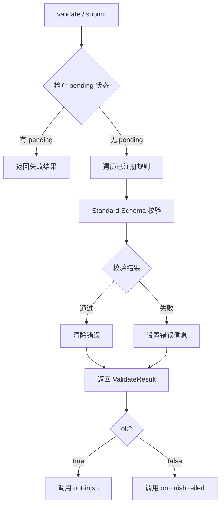
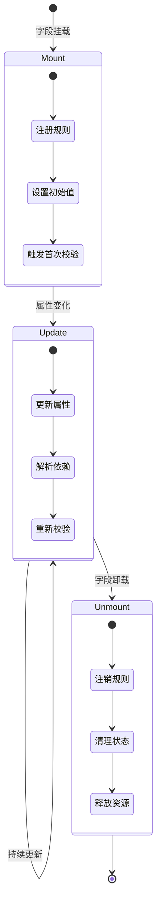
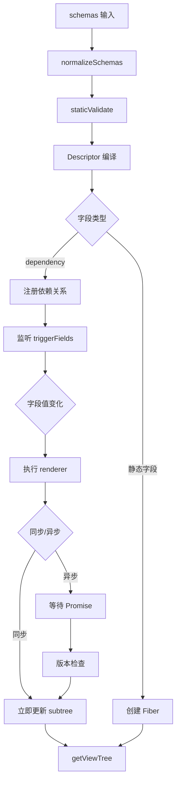

# @schemx/core

> 框架无关的表单引擎核心（Framework-agnostic form engine core）

基于响应式系统的表单状态管理与校验引擎，提供细粒度依赖追踪、Standard Schema 兼容校验、动态表单配置等能力。可在 Vue、React 或任意 JavaScript 运行时中使用。

## 特性

- **框架无关** - 核心逻辑与 UI 框架解耦，支持 Vue、React 等任意框架
- **细粒度响应式** - 基于 ReactiveMap 实现字段级依赖追踪，精确更新
- **Standard Schema 兼容** - 支持 Zod v4、Valibot、ArkType 等验证库
- **动态表单** - 支持基于字段依赖的动态渲染和校验规则
- **TypeScript 优先** - 完整类型推断，类型安全的字段路径

## 安装

```bash
# pnpm
pnpm add @schemx/core

# npm
npm install @schemx/core

# yarn
yarn add @schemx/core
```

## 架构概览



### 模块职责

| 模块                 | 职责                                               |
| -------------------- | -------------------------------------------------- |
| **FieldRegistry**    | 字段模型注册与查找，连接 Fiber 与字段呈现态        |
| **Store**            | 字段值、初始值、touched、pending 等表单状态源      |
| **Validator**        | 校验规则管理与错误状态，支持 Standard Schema 接口  |
| **Form Graph**       | Descriptor 编译、Dependency 解析、字段生命周期管理 |
| **Reactivity**       | 响应式基础设施，提供 Signal、Effect、Batch 能力    |
| **RendererRegistry** | 渲染器组件注册与查找                               |
| **RulesRegistry**    | 校验规则注册与解析                                 |

### Runtime Graph Flow

运行时结构更新遵循单向流程：

```text
schemas
  -> compileToDescriptors
  -> commitChildren
  -> RuntimeReconciler
  -> RuntimeFiberManager
  -> ViewRevision
```

- root schemas 和 dependency renderer 生成的 child schemas 都先编译为 descriptor，再通过同一个 `commitChildren(parent, descriptors)` 边界提交。
- `RuntimeReconciler` 只负责结构复用：它只读取 `parent.children` 作为 previous graph，不发布生命周期事件，也不推进视图版本。
- `RuntimeFiberManager` 是生命周期与资源 owner，负责 field model、registry、validation/dependency effects、dependency slot 与 lifecycle event。
- `ViewRevision` 在一次 public commit 完成后只推进一次，因此嵌套 group reconcile 不会造成重复 view tree 投影。
- disposed runtime node 会从 active parent traversal 中移除，但保留 descriptor 和 field model 快照，便于调试与生命周期观察。

## 快速开始

### 基础用法

```typescript
import { createForm } from "@schemx/core"
import { z } from "zod"

// 创建表单实例
const form = createForm({
  initialValues: {
    name: "",
    email: "",
    age: 0,
  },
  onFinish: (values) => {
    console.log("提交成功:", values)
  },
  onFinishFailed: (error) => {
    console.log("校验失败:", error.errors)
  },
})

// 设置字段值
form.setFieldValue("name", "John")

// 获取字段值（响应式，在 effect 中自动追踪）
const name = form.getFieldValue("name")

// 注册校验规则
form.registerRules("email", z.string().email("邮箱格式错误"))
form.registerRules("age", z.number().min(0).max(150), "请输入有效年龄")

// 校验单个字段
const result = await form.validateField("email")
if (!result.ok) {
  console.log(result.error.errors)
}

// 提交表单（自动校验）
await form.submit()

// 重置表单
form.reset()

// 销毁实例
form.destroy()
```

### 使用 Schema 配置

```typescript
import { createForm } from "@schemx/core"

const form = createForm({
  schemas: [
    {
      componentType: "input",
      name: "username",
      label: "用户名",
      rules: "required",
    },
    {
      componentType: "input",
      name: "email",
      label: "邮箱",
      rules: ["required", "email"],
    },
  ],
  onFinish: (values) => {
    // 提交到服务器
  },
})
```

### 动态依赖字段

```typescript
import { createForm, defineSchemas } from "@schemx/core"

interface FormValues {
  mode: "simple" | "advanced"
  detail?: string
}

const schema = defineSchemas<FormValues>()

const form = createForm<FormValues>({
  initialValues: { mode: "simple" },
  schemas: schema([
    {
      componentType: "select",
      name: "mode",
      label: "模式",
      componentProps: {
        options: [
          { label: "简单模式", value: "simple" },
          { label: "高级模式", value: "advanced" },
        ],
      },
    },
    schema.dependency({
      componentType: "dependency",
      to: ["mode"],
      renderer: (values) => {
        if (values.mode === "advanced") {
          return [{ componentType: "input", name: "detail", label: "详情" }]
        }
        return []
      },
    }),
  ]),
})

// 等待依赖解析完成
await form.waitForDependencies()

// 获取 ViewNode 投影
const viewTree = form.getViewTree()
```

## 核心 API

### createForm

创建表单实例的工厂函数。

```typescript
interface CreateFormOptions<T extends Values> {
  /** 表单字段配置 */
  schemas?: SchemxField<T>[]
  /** 初始值 */
  initialValues?: T
  /** 双向绑定的表单值 */
  modelValue?: T
  /** 渲染器注册实例 */
  rendererRegistry?: RendererRegistry
  /** 默认渲染器类型 */
  defaultRendererType?: SchemxRendererKey<T>
  /** 规则注册实例 */
  rulesRegistry?: RulesRegistry
  /** 全局只读 */
  readonly?: boolean
  /** 全局禁用 */
  disabled?: boolean
  /** 提交成功回调 */
  onFinish?: (values: Readonly<T>) => void | Promise<void>
  /** 提交失败回调 */
  onFinishFailed?: (error: ValidateError<T>) => void
  /** 值变化回调 */
  onValuesChange?: (
    changedValues: Readonly<Partial<T>>,
    latestSnapshot: Readonly<T>
  ) => void
  /** 字段变化回调 */
  onFieldsChange?: (changedFields: NamePath<T>[], allFields: NamePath<T>[]) => void
}

function createForm<T extends Values>(options: CreateFormOptions<T>): SchemxInstance<T>
```

### SchemxInstance

表单实例接口，提供完整的表单操作能力。

#### 值操作

| 方法                         | 说明                                 |
| ---------------------------- | ------------------------------------ |
| `setFieldValue(name, value)` | 设置单个字段值                       |
| `setFieldsValue(values)`     | 批量设置字段值                       |
| `getFieldValue(name)`        | 获取单个字段值（响应式）             |
| `getFieldsValue(names?)`     | 获取多个字段值                       |
| `getFieldSnapshot(name)`     | 获取字段值快照（深拷贝，不收集依赖） |
| `getFieldsSnapshot(names?)`  | 获取表单值快照                       |
| `getInitialValues(names?)`   | 获取初始值                           |
| `setInitialValues(values)`   | 设置初始值                           |

#### 校验操作

| 方法                                          | 说明             |
| --------------------------------------------- | ---------------- |
| `registerRules(name, rules, defaultMessage?)` | 注册校验规则     |
| `unregisterRules(name)`                       | 注销校验规则     |
| `validateField(names)`                        | 校验指定字段     |
| `validate()`                                  | 校验所有字段     |
| `getFieldError(name)`                         | 获取字段错误信息 |
| `setFieldError(name, errors)`                 | 手动设置错误信息 |

#### 状态操作

| 方法                                       | 说明                   |
| ------------------------------------------ | ---------------------- |
| `isFieldTouched(name)`                     | 检查字段是否被修改     |
| `isFieldsTouched(names?)`                  | 检查多个字段是否被修改 |
| `getTouchedFields()`                       | 获取所有被修改的字段   |
| `setFieldPending(name, pending, message?)` | 设置字段操作中状态     |
| `isFieldPending(name)`                     | 检查字段是否操作中     |
| `getPendingFields()`                       | 获取所有操作中的字段   |

#### 生命周期

| 方法                 | 说明                 |
| -------------------- | -------------------- |
| `submit()`           | 提交表单（自动校验） |
| `reset()`            | 重置整个表单         |
| `resetFields(names)` | 重置指定字段         |
| `destroy()`          | 销毁实例             |
| `effect(fn)`         | 创建响应式副作用     |
| `batch(fn)`          | 批量更新             |
| `getInternalHooks()` | 获取内部钩子         |

### createField

创建单字段控制器，将表单实例的方法限定到指定字段。

```typescript
import { createForm, createField } from "@schemx/core"

const form = createForm({ initialValues: { name: "", email: "" } })
const nameField = createField(form, "name")

// 字段操作
nameField.setValue("John")
nameField.getValue() // => 'John'

// 校验
nameField.registerRules("required")
const result = await nameField.validate()

// 状态
nameField.isTouched()
nameField.isPending()
nameField.reset()

// 响应式监听
const dispose = nameField.effect(() => {
  console.log("当前值:", nameField.getValue())
})
dispose() // 取消监听
```

### 响应式工具

#### createEffect

创建响应式副作用，自动追踪依赖。

```typescript
import { createEffect, createForm } from "@schemx/core"

const form = createForm({ initialValues: { name: "" } })

const dispose = createEffect(() => {
  // 自动追踪 form.getFieldValue 的依赖
  console.log("name 变化:", form.getFieldValue("name"))
})

form.setFieldValue("name", "John") // 触发 effect
dispose() // 取消监听
```

#### createWatch

监听字段变化的纯函数版本。

```typescript
import { createWatch, createForm } from "@schemx/core"

const form = createForm({ initialValues: { name: "", email: "" } })

// 监听单个字段
const dispose1 = createWatchField(form, "name", (value) => {
  console.log("name 变化:", value)
})

// 监听多个字段
const dispose2 = createWatchFields(form, ["name", "email"], (values) => {
  console.log("字段变化:", values)
})

// 监听所有字段
const dispose3 = createWatchAll(form, (values) => {
  console.log("表单变化:", values)
})
```

## 数据流



## 响应式系统

### ReactiveMap 原理

每个字段路径对应一个独立的 reactive value，实现细粒度依赖追踪：

```typescript
// 内部实现示意
class ReactiveMap<K, V> {
  private signals = new Map<K, Signal<V>>()

  get(key: K): V {
    // 自动收集依赖
    return this.signals.get(key)?.value
  }

  set(key: K, value: V): void {
    // 自动触发订阅者
    this.signals.get(key).value = value
  }

  batch(fn: () => void): void {
    // 批量更新，合并多次触发
    startBatch()
    fn()
    endBatch()
  }
}
```

### 依赖追踪流程



### 批量更新

```typescript
// 多次 set 合并为一次 effect 触发
form.batch(() => {
  form.setFieldValue("name", "John")
  form.setFieldValue("age", 25)
  form.setFieldValue("email", "john@example.com")
})
// 依赖这些字段的 effect 只触发一次
```

## 校验系统

### Standard Schema 兼容

支持所有实现了 [Standard Schema](https://github.com/standard-schema/standard-schema) 接口的验证库：

```typescript
import { z } from "zod" // Zod v4
import * as v from "valibot" // Valibot
import { type } from "arktype" // ArkType

// Zod
form.registerRules("email", z.string().email())

// Valibot
form.registerRules("email", v.pipe(v.string(), v.email()))

// ArkType
form.registerRules("email", type("string.email"))
```

### 校验流程



### 内置规则

| 规则名           | 说明           |
| ---------------- | -------------- |
| `required`       | 必填校验       |
| `selectRequired` | 选择器必填校验 |
| `uploadRequired` | 上传必填校验   |

### 自定义规则

```typescript
import { createForm, type RuleEntry } from "@schemx/core"
import { z } from "zod"

const form = createForm({ initialValues: { phone: "" } })

// 方式一：直接注册
form.registerRules("phone", z.string().regex(/^1[3-9]\d{9}$/, "手机号格式错误"))

// 方式二：通过 RulesRegistry 注册全局规则
const rulesRegistry = createRulesRegistry()
rulesRegistry.register("phone", {
  schemas: [z.string().regex(/^1[3-9]\d{9}$/)],
  defaultMessage: "请输入正确的手机号",
})

const form2 = createForm({
  rulesRegistry,
  schemas: [{ componentType: "input", name: "phone", rules: "phone" }],
})
```

## 内部 Graph 系统

### 字段生命周期



### Dependency 解析



### Projection 公开入口

通过 `SchemxInstance` 访问内部 projection 能力：

```typescript
// 等待所有依赖解析完成
await form.waitForDependencies(10000)

// 获取 ViewNode 投影
const viewTree = form.getViewTree()

// 渲染器操作
const hooks = form.getInternalHooks()
hooks.registerRenderer("custom-input", CustomInputComponent)
hooks.getRenderer("input")
hooks.hasRenderer("input")

// 规则操作
hooks.registerRule("custom-rule", customRuleEntry)
hooks.getRule("phone")
hooks.hasRule("phone")
```

## 类型定义

### 主要类型导出

```typescript
// 值类型
export type Value = any
export type Values = Record<string, Value>
export type NamePath<T = Values> = DeepNamePath<T>

// 表单实例
export interface SchemxInstance<T extends Values = Values> { ... }

// 配置选项
export interface CreateFormOptions<T extends Values> { ... }
export interface SchemxProps<T extends Values = Values> { ... }

// 校验类型
export type ValidateResult<T> = { ok: true; values: T } | { ok: false; error: ValidateError<T> }
export interface ValidateError<T> { errors: FieldError[]; values: T }
export interface FieldError { field: string; message: string[] }

// 字段配置
export type SchemxField<T = Values> = SchemxBaseField<T> | SchemxGroupField<T> | SchemxDependencyField<T>

// 响应式类型
export interface ReactiveSignal<T> { ... }
export type ReadonlyReactiveSignal<T> = { readonly value: T }
```

## 与框架集成

### Vue 3 集成示例

```typescript
import { createForm } from "@schemx/core"
import { ref, watch, onUnmounted } from "vue"

export function useSchemxForm<T extends Values>(options: CreateFormOptions<T>) {
  const form = createForm(options)

  // 响应式桥接
  const values = ref(form.getFieldsSnapshot()) as Ref<T>

  const dispose = form.effect(() => {
    values.value = form.getFieldsSnapshot()
  })

  onUnmounted(() => {
    dispose()
    form.destroy()
  })

  return { form, values }
}
```

### React 集成示例

```typescript
import { createForm } from "@schemx/core"
import { useState, useEffect, useMemo } from "react"

export function useSchemxForm<T extends Values>(options: CreateFormOptions<T>) {
  const form = useMemo(() => createForm(options), [])

  const [values, setValues] = useState(() => form.getFieldsSnapshot())

  useEffect(() => {
    const dispose = form.effect(() => {
      setValues(form.getFieldsSnapshot())
    })
    return () => {
      dispose()
      form.destroy()
    }
  }, [form])

  return { form, values }
}
```

## 模块边界说明

### 目录结构

```
src/
├── validator/      # Validator - 校验规则与错误
├── descriptor/     # Descriptor - schema 编译与内部描述符
├── graph/          # Graph - Fiber、Reconciler、Scope 等结构基础设施
├── field/          # Field - 字段模型、字段索引和动态依赖
├── scheduler/      # Scheduler - 异步任务调度
├── view/           # View - ViewNode 投影与订阅
├── reactivity/     # Reactivity - 响应式基础设施
├── registry/       # Registry - 渲染器与规则注册
├── types/          # Types - 类型定义
└── utils/          # Utils - 工具函数
```

### 模块依赖关系

- `validator/` - 依赖 `reactivity/`，不依赖其他模块
- `descriptor/` - 将 raw schema 编译为内部 descriptor
- `graph/` - 领域无关的 Fiber、Reconciler、Scope 等结构基础设施
- `field/` - 表单字段生命周期资源，负责字段和 dependency 的 mount/update/unmount
- `scheduler/` - 管理异步任务与 idle 状态
- `view/` - 将内部 graph 投影为 ViewNode
- `lifecycle/` - 领域无关的生命周期 hook 标准化工具

框架适配层应通过 `SchemxInstance` 公开 API 和 `getInternalHooks()` 访问能力，不直接依赖内部模块实现。

## 许可证

MIT
